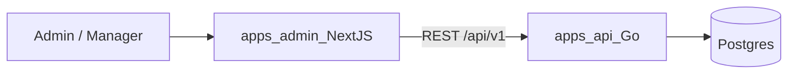

# Plan Admin Frontend — AI Sales Platform

Roadmap ini adalah kelanjutan dari [Go Backend Roadmap](../be/go_backend_roadmap_e471211b.plan.md) dan [AI Service Roadmap](../ai/ai_service_roadmap_9f2c1a7d.plan.md).
Frontend Admin bertugas sebagai antarmuka pengelola (backoffice) untuk mengatur data master dan memantau operasional penjualan yang diotomatisasi oleh AI.

## Keputusan Arsitektur

- **Framework:** Next.js (App Router) dengan TypeScript di `apps/admin/`.
- **Styling & UI:** Tailwind CSS dan shadcn/ui untuk komponen yang bersih dan modern.
- **State & Data Fetching:** React Query (TanStack Query) dan Axios untuk memanggil `/api/v1/...` di backend Go.
- **Autentikasi:** JWT dari backend Go (login via endpoint auth yang sudah ada), disimpan di HTTP-only cookie atau localStorage, dikirim sebagai header `Authorization: Bearer <token>`.
- **Role Base Access:** Mematuhi RBAC dari backend (`admin`, `manager`, `sales`).
- **Routing:** Halaman dilindungi middleware untuk memastikan pengguna terautentikasi sebelum masuk dashboard.

## Kontrak Backend yang Digunakan

Admin menggunakan endpoint standar `/api/v1/...` (membutuhkan JWT, bukan service token seperti AI).

| Kebutuhan Admin | Endpoint Go (Telah disiapkan di BE Phase 5-10) |
|-----------------|-------------------------------------------------|
| Auth | `POST /api/v1/auth/login` |
| Katalog | `CRUD /api/v1/categories`, `CRUD /api/v1/products`, `CRUD /api/v1/product-variants` |
| Pesanan | `GET /api/v1/orders`, `PUT /api/v1/orders/:id/status` |
| Pelanggan | `GET /api/v1/customers` |
| Promo | `CRUD /api/v1/vouchers` |
| Audit & Metrik| `GET /api/v1/audit-logs`, dll (Bisa ditambahkan di fase akhir BE) |

---

## Phase AD1 — Foundation & Authentication

Membangun kerangka proyek dan sistem login.

- Inisialisasi Next.js App Router di `apps/admin/`.
- Setup Tailwind CSS, Shadcn UI (button, input, table, dialog, toast, dll).
- Setup Axios instance dengan interceptor (menyematkan JWT token otomatis, handle 401 Unauthorized untuk force logout).
- Halaman Login (`/login`).
- Layout Dashboard dengan Sidebar (Navigation) dan Header (User Profile/Logout).
- Route Protection (Middleware / HOC).

**Deliverable:** Aplikasi bisa berjalan, admin bisa login menggunakan kredensial dari seed backend, masuk ke halaman dashboard kosong (blank).

---

## Phase AD2 — Catalog Management

Fokus pada pengelolaan data master produk (bersesuaian dengan BE Phase 5).

- Halaman List Kategori (Table, pagination, search, create, edit, delete).
- Halaman List Produk (Table, filter by category/status, search).
- Form Produk (Nama, deskripsi, kategori, status aktif/draft).
- Manajemen Varian (SKU, nama, harga, manajemen stok awal).
- Tombol/Modal untuk Update Stok manual (Tambah/kurang stok `stock_on_hand`).

**Deliverable:** Admin bisa memasukkan data produk baru yang nantinya akan ditawarkan oleh AI ke pelanggan.

---

## Phase AD3 — Orders & Shipping Management

Memantau pesanan yang masuk hasil konversi AI (bersesuaian dengan BE Phase 7, 8, 9).

- Halaman List Pesanan (Table, filter status: draft, waiting_payment, paid, processing, shipped, completed).
- Detail Pesanan (Informasi pelanggan, alamat, list item, total tagihan, riwayat status).
- Integrasi Status Pembayaran: Menampilkan status invoice Xendit dari backend.
- Pengaturan Pengiriman: Update resi manual atau konfirmasi pickup via Biteship (tergantung implementasi webhook BE).
- Fitur ubah status pesanan (misal: "Siap Dikirim" -> "Dikirim").

**Deliverable:** Tim operasional bisa memproses pesanan (packing & shipping) setelah AI berhasil closing dan customer membayar.

---

## Phase AD4 — Customer Management

Melihat data pelanggan (bersesuaian dengan BE Phase 6).

- Halaman List Pelanggan (Data nomor WhatsApp, nama, tanggal bergabung).
- Detail Pelanggan (Riwayat alamat, histori pesanan/order).
- Menampilkan keranjang yang tertinggal (Abandoned Carts) untuk insight.

**Deliverable:** Admin bisa memantau siapa saja yang berinteraksi dan berbelanja melalui WhatsApp.

---

## Phase AD5 — Promo & Voucher Management

Pengaturan diskon (bersesuaian dengan BE Phase 10).

- Halaman List Voucher.
- Form Buat/Edit Voucher (Kode voucher, tipe diskon (persen/nominal), nilai diskon, minimum pembelian, kuota, masa berlaku).
- Fitur aktif/nonaktifkan voucher.

**Deliverable:** Admin dapat membuat campaign promosi yang kodenya bisa di-blast atau dibagikan oleh AI.

---

## Phase AD6 — Inbox Handover (Opsional / Advanced)

Fitur khusus untuk menangani percakapan yang dilempar oleh AI (bersesuaian dengan AI Phase A8).

- Halaman Inbox/Tickets untuk melihat sesi percakapan yang memiliki status `handover=true`.
- Menampilkan history chat AI vs Customer.
- Interface untuk membalas pesan secara manual dan menyelesaikan handover (menggunakan API AI/provider WhatsApp).
- State integrasi yang jelas ketika endpoint inbox AI belum tersedia, tanpa data contoh operasional.

**Deliverable:** Memastikan tidak ada pelanggan yang terbengkalai jika AI tidak bisa menangani masalah (komplain/refund).

---

## Phase AD7 — Dashboard & Audit Logs

Analitik dan keamanan (bersesuaian dengan BE Phase 10 & AI Phase A9).

- Halaman Dashboard Utama:
  - Metric Cards: Total Penjualan, Total Order, Order Hari Ini.
  - Grafik Penjualan (Mingguan/Bulanan).
  - Produk Terlaris.
- Halaman Audit Logs: Menampilkan log aktivitas pengguna admin (siapa mengubah apa).

**Deliverable:** Manajemen memiliki pandangan menyeluruh (helicopter view) tentang performa bisnis dan operasional platform.

---

## Urutan Eksekusi yang Disarankan

Sama seperti BE dan AI, kerjakan secara bertahap (satu phase per PR):

| Urutan | Phase | Fokus |
|--------|-------|--------|
| 1 | AD1 | Setup Next.js, Layout, Auth Login |
| 2 | AD2 | CRUD Kategori & Produk (Katalog) |
| 3 | AD3 | Manajemen Pesanan & Status |
| 4 | AD4 | Data Pelanggan |
| 5 | AD5 | Manajemen Promo / Voucher |
| 6 | AD6 | Handover Inbox (jika diperlukan) |
| 7 | AD7 | Dashboard Analytics & Audit Log |

## Langkah Selanjutnya

Setelah roadmap disetujui, inisiasi proyek Next.js di `apps/admin/` dan mulai kerjakan **Phase AD1**.