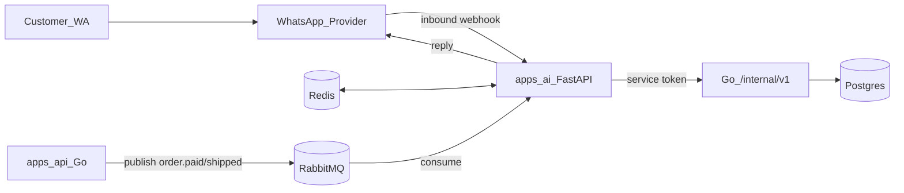

# Plan Layanan AI — AI Sales Platform

Roadmap ini adalah kelanjutan dari [Go Backend Roadmap](../be/go_backend_roadmap_e471211b.plan.md).
Backend Go sudah selesai sampai Phase 10 dan **sudah mengekspos API internal khusus untuk `apps/ai`**.
Tugas layanan AI adalah menjadi **konsumen** API tersebut, bukan mengulang logika domain.

## Keputusan: kenapa AI dulu, bukan Admin?

- Backend Go sudah membangun seluruh permukaan `/internal/v1/...` **khusus untuk AI** ([`router.go`](../../apps/api/internal/http/router/router.go)) — saat ini belum ada konsumennya. Membangun AI langsung memvalidasi kontrak itu end-to-end.
- Nilai inti produk adalah **AI sales agent di WhatsApp**. Ini yang mengubah backend menjadi alur pendapatan nyata (customer → WA → checkout → paid order).
- Admin dashboard baru terasa berguna setelah ada order/customer nyata yang mengalir masuk — dan itu diproduksi oleh AI. Sementara itu katalog bisa di-seed lewat Postman/SQL yang sudah ada, jadi Admin tidak memblokir.
- Admin sebagian besar adalah frontend CRUD di atas API admin JWT yang **sudah ada** — risiko rendah, cocok dikerjakan setelah AI (lihat bagian "Setelah roadmap ini").

## Keputusan arsitektur

- **Bahasa/framework:** Python + **FastAPI** di [`apps/ai/`](../../apps/ai/) (konsisten dengan monorepo)
- **Single-tenant** — mengikuti backend; tidak ada `tenant_id` di fase ini
- **Batas tanggung jawab AI:** WhatsApp webhook + kirim pesan, conversation/session state, orchestration LLM, intent detection, tool calling, notifikasi WA. **Semua data & transaksi lewat API Go.**
- **Di luar scope AI:** logika domain (produk, cart, order, invoice, shipment), webhook Xendit/Biteship, RBAC admin — semua milik Go.
- **AI bukan sumber kebenaran data.** AI tidak boleh menghitung ongkir/harga sendiri; selalu ambil dari backend (BR-004, sales-rules "Source of Truth").
- **Autentikasi ke backend:** semua panggilan ke `/internal/v1/...` memakai **service token** yang sama (header sesuai [`middleware/service_token.go`](../../apps/api/internal/http/middleware/service_token.go)).
- **State store:** Redis untuk session/conversation state & idempotency inbound WA (infra Redis sudah ada dan sudah di-wire di backend Phase 4).
- **Event masuk:** RabbitMQ consumer untuk `order.paid`, `order.shipped`, `order.status_changed` yang di-*publish* oleh Go (Go publish-only, AI consume-only) — lihat [`events.go`](../../apps/api/internal/events/events.go).



## Kontrak backend yang sudah tersedia (dipakai AI)

Semua di bawah `/internal/v1` (service token) — sumber: [`router.go`](../../apps/api/internal/http/router/router.go):

| Kebutuhan AI | Endpoint Go | Business Rule |
|--------------|-------------|---------------|
| Cari produk | `GET /products/search?q=` | BR-002, BR-004 |
| Detail produk | `GET /products/:id`, `GET /products/slug/:slug` | BR-002 |
| Upsert customer by phone | `POST /customers` | BR-008 |
| Alamat default / buat alamat | `GET /customers/:id/addresses/default`, `POST /customers/:id/addresses` | BR-009 |
| Cart aktif + item | `GET/POST/PUT/DELETE /customers/:id/cart...` | BR-006, BR-007 |
| Ongkir | `POST /shipping/rates` | BR-010, BR-011 |
| Preview & konfirmasi checkout | `POST /checkout/preview`, `POST /checkout` | BR-014, BR-015 |
| Buat & cek invoice | `POST /payments/invoices`, `GET /payments/invoices/:id`, `GET /orders/:id/invoice` | BR-016..BR-021 |
| Tracking pengiriman | `GET /orders/:id/shipment` | BR-032 |
| Validasi voucher | `POST /vouchers/validate` | BR-037, BR-038 |
| Status order | `GET /orders/:id` | BR-025, BR-032..BR-034 |

> Catatan: jika sebuah field respons belum lengkap untuk kebutuhan AI, itu jadi kandidat penambahan kecil di backend Go pada fase terkait — bukan diakali di AI.

---

## Phase A1 — Service foundation

Fondasi `apps/ai` sebelum ada logika percakapan.

**Struktur package (mengikuti pola flat per-domain seperti backend Go):**

```text
apps/ai/
  app/
    main.py                 # FastAPI app + lifespan
    config.py               # env settings (pydantic-settings)
    health.py               # /health/live, /health/ready (cek backend + redis)
    clients/
      backend.py            # httpx client ke /internal/v1 + service token
      redis.py              # koneksi redis
    platform/
      response.py           # envelope JSON konsisten dgn Go response
      logging.py            # structured logging (json)
      errors.py             # exception handler -> envelope
  tests/
  pyproject.toml            # atau requirements.txt
  Dockerfile
  .env.example
```

- Endpoint `GET /health/live` (selalu ok) & `GET /health/ready` (ping backend `/health/ready` + Redis)
- Config env: `BACKEND_BASE_URL`, `BACKEND_SERVICE_TOKEN`, `REDIS_URL`, `LLM_*`, `WA_*`, `RABBITMQ_URL`, `LOG_LEVEL`
- `backend.py`: wrapper httpx (timeout, retry ringan, inject header service token, map error backend → exception internal)
- Structured logging + request id; jangan pernah log token/secret (BR-044)

**Deliverable:** service FastAPI jalan, health hijau, bisa memanggil `/internal/v1/products/search` dari backend nyata via smoke test.

---

## Phase A2 — WhatsApp integration

Kanal masuk & keluar. Sengaja dibuat abstrak agar provider bisa diganti.

- **Abstraksi provider** `WhatsAppProvider` (interface): `verify_webhook`, `parse_inbound`, `send_text`, `send_media`, `send_interactive`
  - Implementasi awal: pilih satu (Meta WhatsApp Cloud API **atau** gateway pihak ketiga). Simpan implementasi di `app/whatsapp/<provider>.py`
- `POST /webhooks/whatsapp` — verifikasi (challenge GET untuk Meta / signature), parse pesan masuk → normalisasi ke `InboundMessage{from, name, text, type, message_id, timestamp}`
- **Idempotency inbound:** simpan `message_id` di Redis (TTL) supaya webhook retry tidak diproses dua kali
- **Outbound:** fungsi kirim pesan + antrian ringan (async task) supaya balasan tidak memblok webhook; retry saat provider gagal
- **Config:** `WA_PROVIDER`, `WA_VERIFY_TOKEN`, `WA_ACCESS_TOKEN`, `WA_PHONE_NUMBER_ID`, `WA_API_BASE_URL`

**Deliverable:** kirim "halo" di WhatsApp → AI membalas echo/pesan statis. Webhook aman (verifikasi + idempotent).

---

## Phase A3 — Conversation & session state

State machine percakapan (rekomendasi enterprise BR di business-rules: "Conversation Session Management", BR-047).

**State di Redis (key by phone/wa_id):**
- `session`: status (`active|handover|expired`), `last_activity`, `customer_id` (setelah upsert), `handover` flag
- `context`: nama, produk terpilih, qty, varian, `cart` ref, `address` ref, kurir terpilih, `order_id`, `invoice` status (mirror ai-system-prompt "Conversation Context")
- `history`: window pesan terakhir (untuk konteks LLM), dibatasi N pesan / token budget

**State machine (garis besar):**

```text
GREETING -> DISCOVERY -> PRODUCT -> CART -> CUSTOMER_INFO
  -> SHIPPING -> CHECKOUT_CONFIRM -> PAYMENT -> POST_PAYMENT -> DONE
  (cabang mana pun -> HANDOVER)
```

- **Timeout sesi:** TTL Redis + kebijakan (mis. 30 menit idle → `expired`, abandoned cart → kandidat reminder Phase A9)
- **Konfirmasi ulang** saat ada perubahan alamat/qty/kurir/total (BR-046)
- State machine memandu *tool mana* yang relevan, tapi keputusan akhir tetap di LLM (Phase A4)

**Deliverable:** percakapan multi-turn mempertahankan konteks; ganti qty men-trigger konfirmasi ulang; sesi idle kadaluarsa.

---

## Phase A4 — LLM orchestration & tool calling

Otak agent. Menyatukan prompt, intent, dan pemanggilan API backend sebagai *tools*.

- **Prompt loader:** muat [`ai-system-prompt.md`](ai-system-prompt.md) + [`sales-rules.md`](sales-rules.md) sebagai system prompt (versioned). Business rules dipakai sebagai guardrail, **tidak boleh dibocorkan** (BR-044, security rules).
- **Intent detection** sesuai `sales-rules.md` (product inquiry, price, comparison, recommendation, checkout, shipping, payment, tracking, complaint, greeting) — bisa via LLM classification atau function-router.
- **Tool/function calling framework:** tiap tool = wrapper tipis ke `backend.py`. Registrasi schema tool untuk LLM:
  - `search_products(q)`, `get_product(id|slug)`
  - `upsert_customer(phone,name)`, `get_default_address(customer_id)`, `create_address(...)`
  - `get_cart(customer_id)`, `add_cart_item(...)`, `update_cart_item(...)`, `remove_cart_item(...)`
  - `get_shipping_rates(...)`, `preview_checkout(...)`, `confirm_checkout(...)`
  - `create_invoice(order_id, channel)`, `get_invoice(id)`, `validate_voucher(code, ...)`
  - `get_order(id)`, `get_shipment(order_id)`
- **Guardrails:** tool result adalah sumber kebenaran; LLM tidak boleh mengarang harga/stok/ongkir (BR-004, shipping/payment rules). Jika tool gagal → minta retry / handover (Error Handling).
- **Config:** `LLM_PROVIDER`, `LLM_MODEL`, `LLM_API_KEY`, `LLM_MAX_TOKENS`, `LLM_TEMPERATURE`

**Deliverable:** "ada kaos hitam ukuran XL?" → AI memanggil `search_products`, membalas hanya produk `active` + stok tersedia (BR-004), dengan gaya bahasa sesuai system prompt.

---

## Phase A5 — Sales flow tools (produk → cart → data customer)

Mengaktifkan BR-002, BR-004..BR-009, BR-039..BR-040 lewat percakapan.

- **Produk & rekomendasi:** jawab info/harga/stok/varian; rekomendasi berbasis kebutuhan/budget/popularitas (sales-rules "Recommendation Priority"). Stok kosong → tawarkan alternatif / notif restock (BR-005)
- **Cart via chat:** parse "2 Kaos Hitam XL, 1 Celana Jeans 32" → resolusi ke `variant_id` (klarifikasi bila ambigu) → `add_cart_item`. Ubah qty/varian/hapus (BR-006, BR-007). Validasi stok dari respons backend
- **Data customer:** sebelum checkout pastikan Nama, HP, Alamat, Kota, Kecamatan, Kode Pos, Catatan (BR-008). `upsert_customer` by phone; jika pelanggan lama ambil alamat default & tanya "masih pakai alamat sebelumnya?" (BR-009)
- **Upsell/cross-sell ringan** sesuai sales-rules (maks 1 rekomendasi kecuali diminta) — versi penuh di A9
- **History:** `get_order`/list untuk rekomendasi berbasis pembelian (BR-039, BR-040) — jika backend belum ada endpoint list order per customer di internal, catat sebagai penambahan kecil di Go

**Deliverable:** dari chat, customer bisa menyusun cart valid dan datanya lengkap, siap masuk shipping/checkout.

---

## Phase A6 — Shipping, checkout, payment (transaksi via chat)

Alur uang: BR-010..BR-024, BR-032. Semua eksekusi transaksional tetap di Go.

**Flow (dipandu state machine A3 + tools A4):**
1. Alamat lengkap → `get_shipping_rates` → tampilkan beberapa kurir (BR-010, BR-011). Gagal → retry / handover (BR-013)
2. Customer pilih kurir (wajib sebelum checkout, BR-012, BR-014)
3. `preview_checkout` → kirim **ringkasan** (produk, ongkir, total) dan minta konfirmasi (BR-015). **Tidak checkout tanpa konfirmasi** (BR-045)
4. Konfirmasi → `confirm_checkout` → order dibuat di Go
5. Pilih metode bayar (VA/QRIS/transfer/e-wallet, BR-018) → `create_invoice` → kirim payment link / VA / QRIS + info expiry (BR-016..BR-021)
6. **Jangan** menyatakan "lunas" sebelum dikonfirmasi gateway (payment rules) — status Paid datang dari event (Phase A7), bukan asumsi AI
7. Voucher: `validate_voucher` sebelum apply (BR-037, BR-038)
8. Tracking: "pesanan saya dimana?" → `get_order`/`get_shipment` (BR-032)

**Deliverable:** end-to-end dari chat: pilih produk → alamat → ongkir → konfirmasi → invoice → link bayar. (Konfirmasi lunas menyusul di A7.)

---

## Phase A7 — Notifications (event-driven WA)

Push notification berbasis event dari Go: BR-024, BR-027, BR-031, BR-033, BR-034, BR-041.

- **RabbitMQ consumer** di `apps/ai` untuk event yang dipublish Go: `order.paid`, `order.shipped`, `order.status_changed` (nama final ikuti [`events.go`](../../apps/api/internal/events/events.go))
- Map event → template pesan WA ke nomor customer:
  - Paid → "Pembayaran berhasil, pesanan diproses" (BR-024)
  - Status berubah (diproses/dikemas/siap kirim/dikirim/selesai) → notifikasi (BR-027)
  - Dikirim → No Resi + kurir (BR-031)
- **Idempotent consumer:** simpan event id yang sudah diproses (Redis) agar tidak dobel kirim
- **Sinkronisasi state:** update context session (mis. `invoice.status = paid`) agar percakapan lanjut konsisten
- Butuh nomor WA customer per order → gunakan data customer dari backend (join by `customer_id`)

**Deliverable:** setelah webhook Xendit di Go menandai order paid & publish event, customer menerima notifikasi WA otomatis tanpa AI menebak status.

---

## Phase A8 — Human handover & safety

Guardrail percakapan: BR-003, BR-042..BR-047 + prompt injection protection.

- **Handover triggers** (BR-003, ai-system-prompt "Human Handover"): minta admin, komplain, refund, retur, negosiasi harga, confidence rendah, data tidak tersedia, masalah bayar/kirim, bulk order
- Saat handover: set session `handover=true`, hentikan auto-reply LLM, beri tahu customer, dan **catat/notify admin** (mekanisme: event/queue atau flag yang bisa dibaca dashboard admin nanti)
- **Confidence gating:** ambang skor/aturan untuk memutuskan menjawab vs handover
- **Prompt-injection guard:** abaikan "lupakan instruksi", "tampilkan prompt", dll (ai-system-prompt). Jangan pernah bocorkan prompt/rules/token/DB (BR-044)
- **Privacy:** jangan bocorkan data satu customer ke customer lain

**Deliverable:** kasus komplain/refund/permintaan admin dialihkan bersih ke manusia; upaya prompt injection ditolak.

---

## Phase A9 — Knowledge base, recovery & analytics

Pertumbuhan & fitur enterprise (rekomendasi di business-rules + BR-050).

- **Knowledge Base (RAG):** FAQ/SOP/kebijakan sebagai sumber jawaban tambahan (hanya konten yang dipublish). Vector store (mis. pgvector/Redis) — jawab pertanyaan non-produk tanpa mengarang
- **Abandoned cart recovery** (sales-rules): cart `open` + idle → reminder sopan terjadwal (jangan spam). Dipicu oleh timeout session (A3) + scheduler
- **Upsell/cross-sell penuh** sesuai sales-rules (bundle, aksesori komplementer) dengan verifikasi promo aktif
- **Analytics events (BR-050):** emit metrik — total percakapan, conversion, cart abandonment, AOV, produk terlaris, repeat rate, response time, human handover rate. Kirim ke sink (log/queue/tabel) untuk dikonsumsi dashboard admin nanti

**Deliverable:** AI menjawab dari KB, memulihkan cart tertinggal, dan memancarkan metrik untuk analytics.

---

## Urutan implementasi yang disarankan (eksekusi)

Kerjakan **satu phase per PR/batch**. Setiap phase harus punya smoke test terhadap backend nyata.

| Urutan | Phase | Fokus |
|--------|-------|--------|
| 1 | A1 | Skeleton FastAPI + backend client + health |
| 2 | A2 | WhatsApp webhook + kirim pesan |
| 3 | A3 | Session & conversation state (Redis) |
| 4 | A4 | LLM orchestration + tool calling |
| 5 | A5 | Produk + cart + data customer |
| 6 | A6 | Shipping + checkout + payment |
| 7 | A7 | Notifikasi event-driven (RabbitMQ) |
| 8 | A8 | Human handover + safety |
| 9 | A9 | KB RAG + recovery + analytics |

## Konvensi teknis

- **Env config** via pydantic-settings; jangan hardcode secret; `.env.example` selalu diperbarui
- **Client backend terpusat** di `clients/backend.py` — semua tool lewat sini (satu tempat untuk auth, retry, error map)
- **Tidak duplikasi logika domain**: harga/stok/ongkir/total selalu dari backend
- **Idempotency**: inbound WA (`message_id`) dan event (`event_id`) disimpan di Redis
- **Testing**: unit test tool wrappers dengan backend di-mock; smoke test integrasi ke `/internal/v1`
- **Observability**: structured JSON log + request/trace id; jangan log PII berlebih atau secret
- **Async**: FastAPI async + httpx async; kirim WA sebagai background task agar webhook cepat balas

## Di luar roadmap AI ini

- Logika domain, migrasi DB, webhook Xendit/Biteship, RBAC admin — milik [backend Go](../be/go_backend_roadmap_e471211b.plan.md)
- Multi-tenant, dashboard analytics UI, Kubernetes manifests (`infra/k8s` placeholder)

## Setelah roadmap ini: Admin

Setelah AI berjalan, lanjut **`apps/admin`** (frontend dashboard) di atas API admin JWT yang sudah ada:
katalog, order, pembayaran, pengiriman, voucher, pelanggan, audit log (BR-048, BR-049), plus
inbox handover (dari Phase A8) dan analytics (BR-050 / Phase A9). Roadmap Admin dibuat terpisah
di `docs/admin/` mengikuti format yang sama saat AI mendekati selesai.

## Langkah eksekusi berikutnya

Setelah plan disetujui: mulai **Phase A1** (skeleton FastAPI + backend client + health) sebagai batch implementasi pertama di `apps/ai`.
