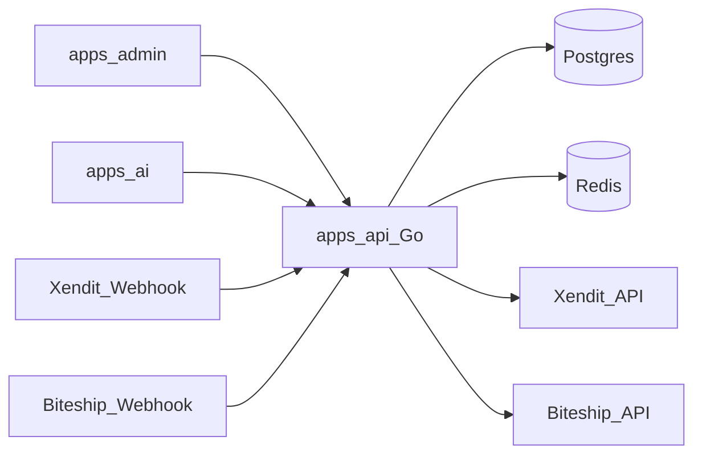

# Plan Backend Go — AI Sales Platform

## Keputusan arsitektur

- **Single-tenant** — tidak ada `tenant_id` di schema fase ini
- **Batas tanggung jawab Go:** domain data (produk, customer, cart, order, payment, shipping) + webhook Xendit/Biteship + API admin + **API internal** untuk `apps/ai`
- **Di luar scope Go:** WhatsApp webhook, LLM, conversation state — milik `apps/ai`
- **Pola kode:** lanjutkan pola domain flat seperti [`apps/api/internal/auth/`](apps/api/internal/auth/) (`handler` → `service` → `repository` interface + `postgres_repository`)
- **Prefix API:** `/api/v1/...` untuk resource baru; health/auth yang sudah ada tetap; endpoint internal AI di `/internal/v1/...` dilindungi service token
- **Infra yang sudah ada dipakai bertahap:** Postgres dulu; Redis untuk cart/session & inventory lock; RabbitMQ untuk notifikasi async (fase belakangan)



## Fondasi yang dipertahankan

- Envelope JSON di [`platform/response`](apps/api/internal/platform/response/response.go)
- Middleware chain di [`router.go`](apps/api/internal/http/router/router.go)
- DI di [`container.go`](apps/api/internal/container/container.go)
- Migration SQL di [`database/migration/`](database/migration/) (lanjut dari `000001_create_users.sql`)

---

## Phase 4 — Platform hardening (pra-domain)

Perkuat fondasi sebelum domain bisnis besar.

- Health `ready` cek koneksi Postgres (bukan selalu `ok`)
- Middleware RBAC sederhana: role `admin|manager|sales|viewer` dari JWT claims (sudah ada di users)
- Wire Redis client di container (config sudah ada, belum dipakai)
- Standardisasi error: prefer `apperror` + `ErrorHandler` di handler baru
- Group route `/api/v1` + middleware auth untuk admin API
- Migration helper di Makefile (`make migrate-up` / dokumentasi jalankan SQL) — tetap file SQL berurutan

**Deliverable:** API siap terima domain baru dengan authz + readiness nyata.

---

## Phase 5 — Product catalog

Domain inti untuk BR-004, BR-005, BR-048.

**Schema (migration baru):**
- `categories` — id, name, slug, is_active, timestamps
- `products` — id, category_id, name, slug, description, status (`active|inactive|draft`), timestamps
- `product_variants` — id, product_id, sku, name (warna/ukuran), price, stock, is_active
- Index: slug unique, sku unique, status+stock untuk query AI

**API Admin (`/api/v1`, JWT + role admin/manager):**
- CRUD category, product, variant
- Update stok manual
- Filter list: status, kategori, search nama

**API Internal AI (`/internal/v1`, service token):**
- `GET /products/search?q=`
- `GET /products/:id` / by slug
- Hanya produk `active` + variant available (BR-004)

**Pola package:** `internal/catalog/` (atau pecah `category`/`product` jika file membengkak)

---

## Phase 6 — Customers & cart

Domain BR-006–BR-009.

**Schema:**
- `customers` — id, phone (unique), name, timestamps
- `customer_addresses` — customer_id, label, address fields (nama, hp, alamat, kota, kecamatan, kode_pos, catatan), `is_default`
- `carts` — id, customer_id, status (`open|checked_out|abandoned`), timestamps
- `cart_items` — cart_id, variant_id, qty, unit_price snapshot

**Perilaku:**
- Satu cart `open` per customer
- Validasi stok saat add/update item
- Alamat terakhir / default untuk BR-009

**API Admin:** list/get customer, alamat  
**API Internal AI:** upsert customer by phone, CRUD cart items, get default address

**Redis (opsional di fase ini):** cache cart aktif by `customer_id` — boleh ditunda jika Postgres cukup

---

## Phase 7 — Checkout, order, inventory reservation

Domain BR-014–BR-015, BR-035–BR-036 + rekomendasi reservation.

**Schema:**
- `orders` — nomor order, customer_id, alamat snapshot, status, subtotal, shipping_fee, total, courier fields, timestamps
- `order_items` — order_id, variant_id, qty, unit_price, product name snapshot
- Status awal order: `draft` → setelah konfirmasi checkout menjadi siap invoice

**Flow checkout (service):**
1. Validasi cart tidak kosong, alamat lengkap, kurir dipilih (kurir/tarif dari fase shipping — stub dulu boleh hardcode fee jika Biteship belum)
2. Buat order + items dari cart (transaksi DB)
3. **Reserve stock** (kurangi `available` / naikkan `reserved` pada variant) — kolom `stock` dipecah jadi `stock_on_hand` + `stock_reserved` di migration phase ini
4. Tutup cart

**API Internal AI:** `POST /checkout` (summary preview + confirm)  
**API Admin:** list/get order, update status fulfillment (BR-026) setelah paid

---

## Phase 8 — Payment (Xendit)

Domain BR-016–BR-024, BR-042. Referensi: <https://docs.xendit.co/apidocs>.

**Schema:**
- `invoices` — order_id, invoice_no, amount, status (`waiting_payment|paid|expired|failed`), expired_at, payment_channel, xendit refs (`xendit_invoice_id`, `xendit_external_id`, `xendit_payment_url`)
- `payment_events` — raw webhook log untuk audit (idempotency key = `xendit_invoice_id` + `event`)

**Integrasi:**
- Client Xendit di `internal/payment/xendit/` — panggil `POST /v2/invoices` (Xendit Invoice API) menggunakan HTTP Basic auth (`SECRET_KEY:`)
- `POST /webhooks/xendit` — verifikasi header `x-callback-token` (BR-042), idempotent update invoice + order berdasarkan `external_id`/`id`
- Job/expiry: invoice expired → release reserved stock (bisa cron CLI `cmd/worker` atau query on-read dulu)

**Setelah Paid:** set order `paid`, commit stock reservation (BR-035), publish event (RabbitMQ nanti / sync hook dulu untuk notifikasi via AI)

**Config baru:** `XENDIT_*` di [`config.go`](apps/api/internal/config/config.go) — `XENDIT_SECRET_KEY`, `XENDIT_CALLBACK_TOKEN`, `XENDIT_BASE_URL` (default `https://api.xendit.co`), `XENDIT_INVOICE_DURATION` (detik, default 86400 = 24 jam), `XENDIT_SUCCESS_REDIRECT_URL`, `XENDIT_FAILURE_REDIRECT_URL`

---

## Phase 9 — Shipping (Biteship)

Domain BR-010–BR-013, BR-028–BR-034, BR-043.

**Integrasi:**
- Client Biteship: rate quote + create shipment
- `POST /internal/v1/shipping/rates` — untuk AI sebelum checkout
- Create shipment saat admin set status siap kirim / otomatis setelah paid (ikuti BR-028)
- `POST /webhooks/biteship` — tracking update → order `shipped` / `delivered` → `completed` setelah X hari (config)

**Schema tambahan:** `shipments` — order_id, courier, service, tracking_no, label_url, status

**Config:** `BITESHIP_*`

---

## Phase 10 — Promo, audit, internal polish

- `vouchers` / `promotions` (BR-037–BR-038) — apply di checkout
- `audit_logs` untuk aksi admin (BR-049)
- Harden internal auth (service token rotation), rate limit webhook
- Wire RabbitMQ untuk event `order.paid`, `order.shipped` yang dikonsumsi `apps/ai` untuk WA notify (Go publish only)

---

## Urutan implementasi yang disarankan (eksekusi)

Kerjakan **satu phase per PR/batch**, jangan campur domain besar.

| Urutan | Phase | Fokus |
|--------|-------|--------|
| 1 | 4 | Hardening + RBAC + Redis wire + ready check |
| 2 | 5 | Catalog + migration + admin & internal read API |
| 3 | 6 | Customer + cart |
| 4 | 7 | Checkout + order + stock reservation |
| 5 | 8 | Xendit + webhooks |
| 6 | 9 | Biteship + webhooks |
| 7 | 10 | Promo + audit + events |

## Konvensi teknis per domain baru

Setiap domain mengikuti template auth:

```text
internal/<domain>/
  handler.go
  service.go
  repository.go          # interface
  postgres_repository.go
  models.go
  service_test.go        # stub repo, std testing
```

- Transaksi multi-table pakai `pgx.Tx` di service/repository
- Tidak expose password/secret di response (BR-044)
- Migration: `database/migration/00000N_*.sql` up-only dulu (konsisten dengan yang ada)

## Di luar roadmap Go ini

- `apps/admin` UI, `apps/ai` FastAPI, multi-tenant, conversation state machine, analytics dashboard
- Kubernetes manifests (`infra/k8s` tetap placeholder)

## Langkah eksekusi berikutnya

Setelah plan disetujui: mulai **Phase 4** (hardening) sebagai batch implementasi pertama di `apps/api`.
